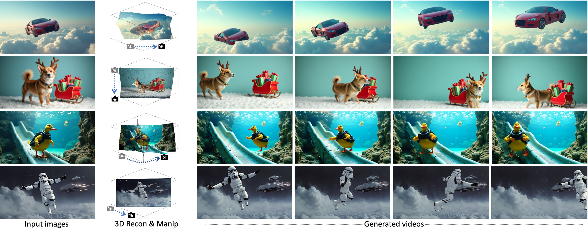

# I2V3D: Controllable image-to-video generation with 3D guidance (ICCV 25)



Zhiyuan Zhang $^{1}$, [Dongdong Chen](https://www.dongdongchen.bid/) $^{2}$, [Jing Liao](https://www.cityu.edu.hk/stfprofile/jingliao.htm) $^{1}$

<font size="1"> $^1$: City University of Hong Kong, Hong Kong SAR
<font size="1"> $^2$: Microsoft GenAI </font>

## Abstract:
We present I2V3D, a novel framework for animating static images into dynamic videos with precise 3D control, leveraging the strengths of both 3D geometry guidance and advanced generative models. Our approach combines the precision of a computer graphics pipeline, enabling accurate control over elements such as camera movement, object rotation, and character animation, with the visual fidelity of generative AI to produce high-quality videos from coarsely rendered inputs. To support animations with any initial start point and extended sequences, we adopt a two-stage generation process guided by 3D geometry: 1) 3D-Guided Keyframe Generation, where a customized image diffusion model refines rendered keyframes to ensure consistency and quality, and 2) 3D-Guided Video Interpolation, a training-free approach that generates smooth, high-quality video frames between keyframes using bidirectional guidance. Experimental results highlight the effectiveness of our framework in producing controllable, high-quality animations from single input images by harmonizing 3D geometry with generative models.

## Installation
```bash
conda create -n i2v3d python=3.10
conda install pytorch==2.3.1 torchvision==0.18.1 pytorch-cuda=12.1 -c pytorch -c nvidia
pip install -r requirements.txt
```

## TODO List
- [x] Add guidance for build custimized scene in blender
- [x] Upload examples 

## Usage
We provide multiple examples in [bestzzhang/I2V3D_examples](https://huggingface.co/datasets/bestzzhang/I2V3D_examples/tree/main)
```
# Optional (download our examples and trained Lora)
huggingface-cli download bestzzhang/I2V3D_examples --local-dir ./static --repo-type dataset

# 1. LoRA Customization with Multi-View Images:  
cd phase1_lora
bash run.sh

2. Keyframe Generation
cd phase2_keyframes
bash run.sh

3. Video Generation by interpolating keyframes
cd phase3_interp
bash run.sh
```

