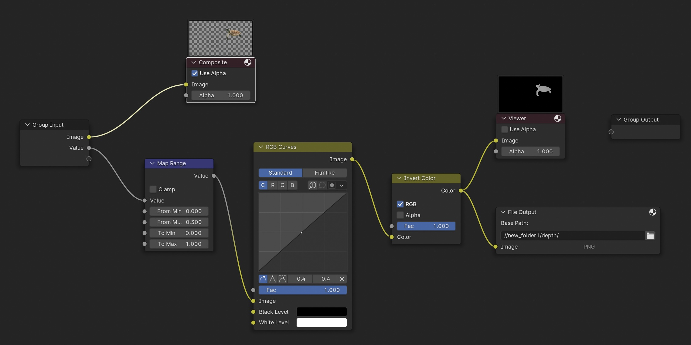

# Steps on building blender scene

## Table of Contents
- [Step1: Segment and Inpaint](#step1-segment-and-inpaint)
- [Step2: Foreground Mesh Generation](#step2-foreground-mesh-generation)
- [Step2.5 (Optional): Rigging and Animating Mesh](#step25-optional-rigging-and-animating-mesh)
- [Step3: Background Mesh Generation](#step3-background-mesh-generation)
- [Step4: Final Scene Composition](#step4-final-scene-composition)

## Step1: Segment and Inpaint

To build the scene, we first need to segment foreground object and Inpaint the foreground region to get clean background. Segment model and inpainting model can be accessed though the following link.

- Segment: [SAM](https://github.com/facebookresearch/segment-anything)
- Inpaint: [Stable Diffusion XL](https://huggingface.co/diffusers/stable-diffusion-xl-1.0-inpainting-0.1)

After this step, we obtain the foreground and background image.

## Step2: Foreground Mesh Generatation

To generate the foreground mesh from foreground image, we adopt [InstantMesh](https://github.com/TencentARC/InstantMesh), which generate multi-view images of foreground object with its textured mesh in obj format.

## Step2.5 (Optional): Rigging and Animating Mesh

You can convert obj format mesh to fbx format, then with Rigging and Animating with [Mixamo](https://www.mixamo.com/#/).  You can watch [this youtube video](https://www.youtube.com/watch?v=WUI2uoJBBpQ) for clear instructions.

## Step3: Background Mesh Generatation

To generate the background mesh from background, we first adopt [ViewCrafter](https://github.com/Drexubery/ViewCrafter) to generate multi-view images of background, which expand the original scene. We pick 1-4 images from generated image set and then use [Dust3R](https://github.com/naver/dust3r) to extract the background mesh in the glb format. 

- ViewCrafter: We provide example script to generate multi-view images, which should be put inside Viewcrafter repository. Some trajectories is defined but you can also define your own trajectory following their instructions.

- Dust3R: inside Dust3R repository, modify _convert_scene_output_to_glb function and run demo.py , which interactive demo is provided.

  <details>
    <summary> _convert_scene_output_to_glb(modified) </summary>
  
    ```python
  
      def _convert_scene_output_to_glb(outdir, imgs, pts3d, mask, focals, cams2world, cam_size=0.05,
                                   cam_color=None, as_pointcloud=False,
                                   transparent_cams=False, silent=False):
                                   
      assert len(pts3d) == len(mask) <= len(imgs) <= len(cams2world) == len(focals)
      pts3d = to_numpy(pts3d)
      imgs = to_numpy(imgs)
      focals = to_numpy(focals)
      cams2world = to_numpy(cams2world)
  
      scene = trimesh.Scene()
      
      # full pointcloud
      if as_pointcloud:
          pts = np.concatenate([p[m] for p, m in zip(pts3d, mask)])
          col = np.concatenate([p[m] for p, m in zip(imgs, mask)])
          pct = trimesh.PointCloud(pts.reshape(-1, 3), colors=col.reshape(-1, 3))
          scene.add_geometry(pct)
      else:
          meshes = []
          for i in range(len(imgs)):
              meshes.append(pts3d_to_trimesh(imgs[i], pts3d[i], mask[i]))
          mesh = trimesh.Trimesh(**cat_meshes(meshes))
          scene.add_geometry(mesh)
      
      # add each camera
      plane_centers = []
      vo_arr = []
      for i, pose_c2w in enumerate(cams2world):
          if isinstance(cam_color, list):
              camera_edge_color = cam_color[i]
          else:
              camera_edge_color = cam_color or CAM_COLORS[i % len(CAM_COLORS)]
          plane_center, v0 = add_scene_cam(scene, pose_c2w, camera_edge_color,
                        None if transparent_cams else imgs[i], focals[i],
                        imsize=imgs[i].shape[1::-1], screen_width=cam_size)
          plane_centers.append(plane_center)
          vo_arr.append(v0)
      
      rot = np.eye(4)
      rot[:3, :3] = Rotation.from_euler('y', np.deg2rad(180)).as_matrix()
      transform_mat = np.linalg.inv(cams2world[0] @ OPENGL @ rot)
      # print(transform_mat)
      scene.apply_transform(transform_mat)
      
      ### modify here
      def compute(x, y, z):
          point = np.array([x, y, z, 1])
          transformed_point = np.dot(transform_mat, point)
          transformed_point = transformed_point / transformed_point[3]
          x_new, y_new, z_new = transformed_point[:3]
          return [x_new, y_new, z_new]
      
      start_arr = []
      end_arr = []
      up_arr = []
      for pose_c2w, plane_center, v0 in zip(cams2world, plane_centers, vo_arr):
          x, y, z = pose_c2w[:3,3]
          start_arr.append(compute(x, y, z))
          x, y, z = plane_center
          end_arr.append(compute(x, y, z))
          x, y, z = v0
          up_arr.append(compute(x, y, z))
          img_size = imgs[i].shape[1::-1]
          fov_radians = 2 * math.atan(img_size[0] / (2 * focals[i]))
          fov_degrees = math.degrees(fov_radians)
          print(fov_degrees)
      
      with open("save_camera_infos.json", "w") as f:
          camera_info = {
              "start_pos": start_arr,
              "end_pos": end_arr,
              "up_pos": up_arr,
              "fov": fov_degrees
          }
          json.dump(camera_info, f, indent=4)
      
      # Optionally, export to a buffer (string or bytes)
      scene_data = scene.export(file_type='obj')  
      outfile = os.path.join(outdir, 'scene.obj')
      with open(outfile, "w") as f:
          f.write(scene_data)
      
      # outfile = os.path.join(outdir, 'scene.glb')
      # if not silent:
      #     print('(exporting 3D scene to', outfile, ')')
      # scene.export(file_obj=outfile)
      return outfile
    ```
  
   </details>

## Step4: Final Scene Composition

We provide a standard blender file which contains all the modifications you need to rendered RGB and depth frames.

1. For rendering RGB, we modify three places:

   1. In right side bar: Render -> color management -> standard

   1. Select each mesh: In top bar: Shading: Connect Color to Surface directly.

   1. Need to use the obj format to import the background mesh

2. For rendering depth, you can use our created compositing nodes.

   

3. For set up the camera trajectory, you can either do it by hand or run the our script inside blender, which use saved camera poses in save_camera_infos.json.